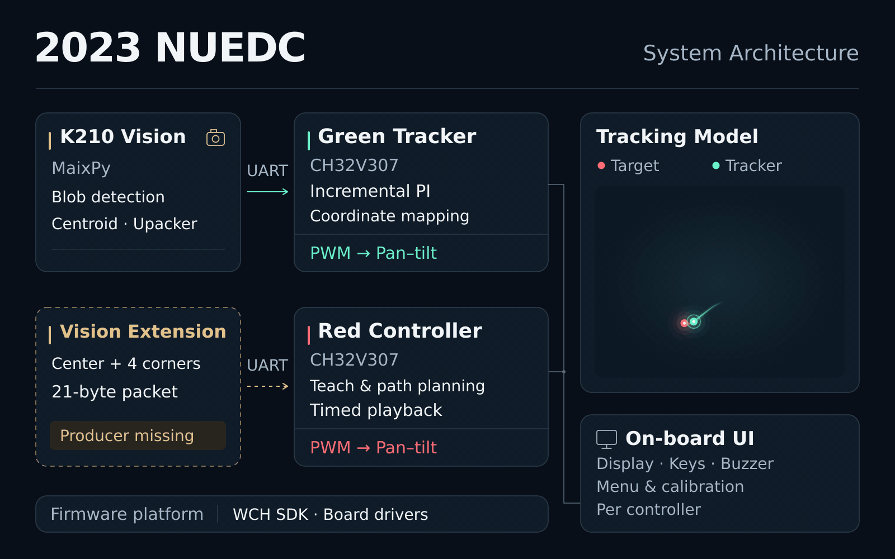

# 2023NUEDC

The figure maps the source architecture. Its tracking inset uses the repository's PI controller with assumed actuator dynamics; it is not recorded hardware performance. The dashed vision-extension input identifies a producer missing from this checkout.

## 项目简介
本仓库用于存放2023年全国大学生电子设计竞赛(NUEDC)的参赛代码，包含 K210 / MaixPy 视觉处理、CH32V307 绿色光点跟踪固件、红色光点路径控制固件，以及串口协议和设备调试示例。

## 获奖情况
- **全国一等奖**
- **上海市一等奖**

## System components

| Component | Source | Responsibility |
| --- | --- | --- |
| K210 vision | [PyCode/main.py](PyCode/main.py) | Detect the largest thresholded blob in the central ROI; send its centroid through Upacker over UART. |
| Green tracker | [green_firm](Ccode/green_firm/project) | Search/acquire/follow, dual-axis incremental PI, coordinate mapping, and servo PWM. |
| Red path controller | [red_firm](Ccode/red_firm/project) | Teach points, generate paths, and execute timed two-axis servo motion. This is a separate firmware branch. |
| On-board interaction | [Green menu](Ccode/green_firm/project/code/easy_ui_user_app.c) · [Red menu](Ccode/red_firm/project/code/easy_ui_user_app.c) | Display, keys, mode selection, calibration interfaces, and buzzer feedback on each controller. |
| Communication | [Upacker](Upacker) | Byte framing and partial XOR checks. Application payloads differ between the green, red, and demo programs. |
| Firmware foundation | [Green libraries](Ccode/green_firm/libraries) · [Red libraries](Ccode/red_firm/libraries) | WCH SDK, board drivers, display support, timers, UART, GPIO, and PWM. Bundled drivers do not imply every peripheral is used. |
| Device utilities | [Camera demo](PyCode/CameraDemo.py) · [UART demo](PyCode/UartDemo.py) · [Photo capture](PyCode/takeAphoto_DS.py) | Independent device programs for development, not consecutive stages of the main application. |

## Interfaces and review notes

The main vision script sends a **4-byte centroid payload**. The green firmware consumes that layout, but its coordinate offset does not establish a calibrated tracking-error transform. The red firmware expects a **21-byte centroid / four-corner / validity payload** whose producer is absent from the supplied Python code. The diagram therefore keeps the two inputs separate.

[Architecture and source review](docs/ARCHITECTURE.md) documents the execution paths, packet formats, timing, peripherals, incomplete features, and source-level issues. [Tracking-model notes](docs/TRACKING_MODEL.md) separate the actual PI settings from the animation's assumed plant and calibration.

The pseudo-random target is a visualization input, not a target generator implemented by either firmware. Hardware footage, schematic-level wiring, and measured tracking accuracy are not included in this repository.
